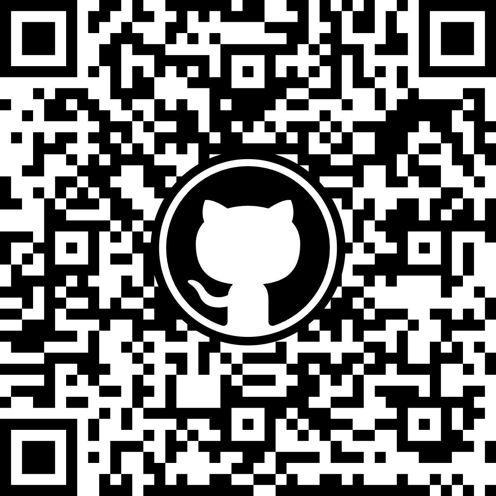

# Paper 2027 Residual Physics Learning
This repository holds important code and artifacts for the 2027 SEM-IMAC paper "Physics-Informed Machine Learning Part V: Residual Learning for State Correction in Structural State Estimation under Model Bias".

## Licensing and Citation
This work is licensed under a Creative Commons Attribution-ShareAlike 4.0 International License [cc-by-sa 4.0].

#### Bibtex

@Misc{Zardian2026PaperResidualPhysics,  
  author = {Mohsen Gol Zardian and Caleb Williams and Austin R.J. Downey},  
  title  = {Paper-Residual-Physics-Learning},  
  groups = {{ARTS-L}ab},  
  year = {2026},  
  url    = {https://github.com/paper-2027-PIML-Part-V-residual-physics-learning},  
}  

QR code for repo.

